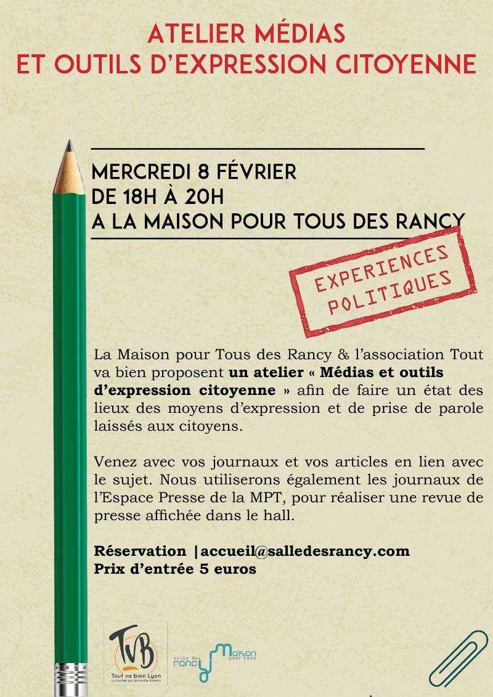

La Maison pour Tous des Rancy, en partenariat avec l’association [Tout va bien](http://toutvabienlejournal.org/), propose un atelier Revue de presse «&nbsp;Médias et outils d’expression citoyenne&nbsp;» afin de faire un état des lieux des moyens d’expression et de prise de parole laissés aux citoyens. À travers l’outil médiatique, nous aborderons rapidement la démocratie participative, les [*civic tech*](https://fr.wikipedia.org/wiki/Civic_tech), la liberté de la presse et élaborerons collégialement une revue de presse sur le sujet. Celle-ci sera affichée à la Maison pour Tous à l'issue de l'atelier.

---

Cet atelier permettra de redéfinir ce qu’est l’expression citoyenne et ses outils puis de mener des enquêtes, rechercher des articles et références sur ce sujet. Le rendu de ces recherches sera partagé afin de laisser un espace d’expression et d’information ouvert à tous.

L'atelier aura lieu le mercredi 8 février de 18h à 20h à la [Maison Pour Tous - Salle des Rancy](/infos/). L'entrée est au prix de 5€ et il est recommandé de réserver soit à l'accueil de la Maison Pour Tous, soit par email à [accueil@salledesrancy.com](mailto:accueil@salledesrancy.com).

Cet atelier est proposé en amont de la semaine [Expériences politiques](/programme/) organisée du 6 au 11 mars 2017 par la Maison Pour Tous des Rancy.
