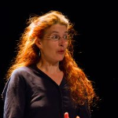
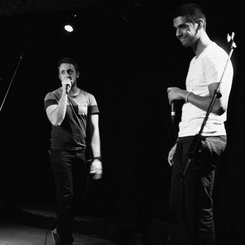

Du 2 au 13 avril 2019, deux semaines autour de la Politique, organisée par la [Maison Pour Tous](https://www.salledesrancy.com/), avec des conférences, des débats, des projections de films, des ateliers…

<ul class="table-of-content">
    <li><i>Accès rapide : </i></li>
    <li><a href="#2019-mardi-2">Mardi 2</a></li>
    <li><a href="#2019-mercredi-3">Mercredi 3</a></li>
    <li><a href="#2019-jeudi-4">Jeudi 4</a></li>
    <li><a href="#2019-vendredi-5">Vendredi 5</a></li>
    <li><a href="#2019-lundi-8">Lundi 8</a></li>
    <li><a href="#2019-mardi-9">Mardi 9</a></li>
    <li><a href="#2019-mercredi-10">Mercredi 10</a></li>
    <li><a href="#2019-jeudi-11">Jeudi 11</a></li>
    <li><a href="#2019-vendredi-12">Vendredi 12</a></li>
    <li><a href="#2019-samedi-13">Samedi 13</a></li>
</ul>

*Tous les évènements sont en accès et à prix libre.*

<section class="event">
    <header>
        <h2 id="2019-mardi-2">Mardi 2 avril Migration : la levée citoyenne</h2>
        
19h30 - [Salle des Rancy](/infos/)

    </header>

    

        Débat
    

</section>

<section class="event">
    <header>
        <h2 id="2019-mercredi-3">
            Mercredi 3 avril
            Concentration des pouvoirs / Concentration des richesses
        </h2>
        
19h00 - [Salle des Rancy](/infos/)

    </header>

    

        Forum, reprendre le pouvoir d’agir avec Noam Chomsky
    

</section>

<section class="event">
    <header>
        <h2 id="2019-jeudi-4">
            Jeudi 4 avril
            Analyse Politique de l'actualité
        </h2>
        
19h00 - [Salle des Rancy](/infos/)

    </header>

    

        Atelier
    

</section>

<section class="event">
    <header>
        

            

                
                Cloé Porthault
            

        

        <h2 id="2019-vendredi-5">
            Vendredi 5 avril
            Travail, faut-il jouer le jeu ?
        </h2>
        
19h30 - [Salle des Rancy](/infos/)

    </header>

    

        Conférence gesticulée &mdash; [informations et réservations](https://festiconfslyon.fr/travail-faut-il-jouer-le-jeu/)
    

    

        Le travail c’est quoi au juste ? Et le chômage ? Qui travaille ? Manifestement, les règles du jeu ont changé au fil des époques. À moins que ce ne soit notre façon de jouer ? Ou bien nos aspirations qui ont évolué face au monde du travail ?
    

    

        Au gré de ses expériences professionnelles et militantes, Cloé s’est lancée dans un véritable jeu de piste pour décrypter le monde du travail, le rôle du syndicalisme et les jeux de pouvoir qui s’y exercent.
    

    

        Conférence dans le cadre du festival [Agitons nos idées](https://festiconfslyon.fr/). La conférence sera suivie de quatre ateliers, les 9 avril, 2 mai, 9 mai et 23 mai. Plus d'informations à l'accueil de la Maison Pour Tous.
    

</section>

<section class="event">
    <header>
        <h2>
            6 et 7 avril
            Journées du Logiciel Libre
        </h2>
        
Toute la journée - [Salle des Rancy](/infos/)

    </header>

    

        Partenaire, salon du logiciel libre lyonnais, avec conférences, ateliers, animations, stands…
    

    

        Lieu de rencontre bouillonnant depuis 1998, les journées du logiciel libre accueillent le temps d'un week-end les curieuses et curieux de tout bord. Qu'importe votre niveau, venez vous initier, partager vos idées, vos programmes, vos projets et construire ensemble des lendemains plus libres !
    

    

        [Toutes les informations sur le site des JDLL](https://www.jdll.org/)
    

</section>

<section class="event">
    <header>
        <h2 id="2019-lundi-8">
            Lundi 8 avril
            Rojava : À la conquête d'un nouvel imaginaire collectif
        </h2>
        
19h00 - [Salle des Rancy](/infos/)

    </header>

    

        Conférence
    

</section>

<section class="event">
    <header>
        

            

                
                Cloé Porthault
            

        

        <h2 id="2019-mardi-9">
            Mardi 9 avril
            Travail, faut-il jouer le jeu ?
        </h2>
        
18h00 - [Salle des Rancy](/infos/)

    </header>

    

        Atelier dans la continuité de la conférence du vendredi 5 avril
    

</section>

<section class="event">
    <header>
        

            

                
                Marianne
            

        

        <h2 id="2019-mercredi-10">
            Mercredi 10 avril
            La roue tourne
        </h2>
        
20h00 - [Salle des Rancy](/infos/)

    </header>

    

        Conférence gesticulée &mdash; [informations et réservations](https://festiconfslyon.fr/la-roue-tourne/)
    

    

        Donner de la voix à ce qu’elle croit, participer à la construction du bien commun, Marianne s’y est essayée en se présentant aux élections municipales dans son village et en travaillant dans une mairie.
    

    

        Au travers de ses expériences, elle questionne la démocratie, ses réalités et ses errances. L’élu, le gouvernant désigné par un résultat sorti des urnes, est vu comme le seul légitime à s’occuper de l’universel. Ce système où se posent les problèmes de la représentation, du cumul et de la longévité des mandats, favorise le conservatisme, et veut nous faire croire que seuls quelques uns sont compétents pour faire de la politique.
    

    

        Cette conférence gesticulée souhaite explorer de nouvelles pistes pour désigner nos gouvernants… notamment le tirage au sort.
    

    

        Conférence dans le cadre du festival [Agitons nos idées](https://festiconfslyon.fr/).
    

</section>

<section class="event">
    <header>
        <h2 id="2019-jeudi-11">
            Jeudi 11 avril
            De l’intérêt de la désobéissance civile
        </h2>
        
18h30 - [Salle des Rancy](/infos/)

    </header>

    

        Formation à l'action directe Non-Violente
    

</section>

<section class="event">
    <header>
        <h2 id="2019-vendredi-12">
            Vendredi 12 avril
            NDDL : les suites
        </h2>
        
18h30 - [Salle des Rancy](/infos/)

    </header>

    

        Conférence
    

</section>

<section class="event">
    <header>
        <h2 id="2019-samedi-13">
            Samedi 13 avril
            Actions locales
        </h2>
        
De 14h à 21h - [Salle des Rancy](/infos/)

    </header>

    <h3>
        14h - 16h30
        Stratégies et pratiques lyonnaises de la décroissance
    </h3>

    

        Événement de soutien à la [revue S!lence](http://www.revuesilence.net/), en présence de nombreux acteurs lyonnais de la décroissance.
    

    <h3>
        17h - 20h
        Urgence sociale et climatique : nouveaux formats de mobilisation
    </h3>

    

        Débat avec notamment des membres des Gilets Jaunes et du Mouvement Climat.
    

    <h3>
        19h00
        Bar et restauration
    </h3>

    

        Ouverture du bar de la Maison Pour Tous, et restauration au profit de la [revue S!lence](http://www.revuesilence.net/).
    

    <h3>
        20h00
        ACS - Rap engagé
    </h3>

    

        Concert de Rap du [groupe ACS](https://www.youtube.com/channel/UC2QAxqDpaYSaJw8nRyKNkyA) !
    

    

        
    

</section>
