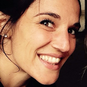
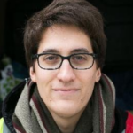
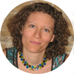
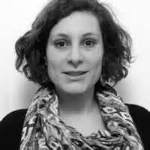
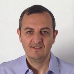
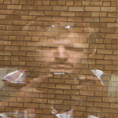
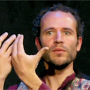
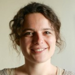
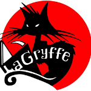

Du lundi 6 mars au vendredi 10 mars, tous les soirs aura lieu une conférence, un débat ou une projection, suivi d'interactions avec le public. Le samedi 11 mars aura lieu une journée d'expérimentations et de mise en contact avec des acteurs locaux de la politique.

<ul class="table-of-content">
    <li><i>Accès rapide : </i></li>
    <li><a href="#2017-lundi">Lundi 6</a></li>
    <li><a href="#2017-mardi">Mardi 7</a></li>
    <li><a href="#2017-mercredi">Mercredi 8</a></li>
    <li><a href="#2017-jeudi">Jeudi 9</a></li>
    <li><a href="#2017-vendredi">Vendredi 10</a></li>
    <li><a href="#2017-samedi">Samedi 11</a></li>
</ul>

*Tous les évènements sont gratuits et en accès libre à l'exception de la soirée du jeudi 9 mars qui est sur réservation et à prix libre.*

<section class="event">
    <header>
        

            

                
                Marielle Benchehboune
            

            

                
                Jean-Michel Knutsen
            

        

        <h2 id="2017-lundi">Lundi 6 mars Transformer la colère en action collective</h2>
        
18h30 - [Salle des Rancy](/infos/)

    </header>

    
Débat suivi de questions du public

    

        Comment transformer la colère des citoyens en action concrète pour agir sur notre monde ? Le *Community Organizing*, méthodologie originaire des États-Unis et formalisée dans les années 1940 par Saul Alinski, s'y essaye avec succès au Royaume Uni et depuis quelques années en France.
    

    
<b>Marielle Benchehboune</b> est organisatrice syndicale à Lyon, et ancienne participante à l'[Alliance Citoyenne](https://alliancecitoyenne.org/) à Grenoble.

    
<b>Jean-Michel Knutsen</b> est organisateur au sein de [Citizens UK](http://www.citizensuk.org/), principal collectif de Community Organizing au Royaume Uni.

    
*Pour aller plus loin sur ce thème, l'association [Tabadol](http://www.tabadol.org/) organise une formation « Construire les intelligences citoyennes » du 6 au 8 juin 2017, toutes les informations sur [tabadol.org](http://www.tabadol.org/formations)*.

</section>

<section class="event">
    <header>
        

            

                
                Florence Martin
            

            

                
                Charlotte Rizzo
            

            

                
                Pierre Sauze
            

        

        <h2 id="2017-mardi">Mardi 7 mars Pouvoir d'agir au travail, expériences vécues</h2>
        
19h00 - [Salle des Rancy](/infos/)

    </header>

    
Débat suivi de questions du public

    

        Dans quelle mesure la démocratie s'exprime-t-elle dans la sphère professionnelle ? Lors de cette table ronde, à travers diverses expériences, vous découvrirez des  exemples locaux d'organisation du travail où le salarié (ou entrepreneur) dispose d'un pouvoir d'agir. Les témoignages concrets de ces acteurs ouvriront l'échange avec le public.
    

    
<b>Florence Martin</b> est présidente de la <abbr title="Société Coopérative d'Intérêt Collectif">SCIC</abbr> [Enercoop Rhône-Alpes](http://rhone-alpes.enercoop.fr/), fournisseur d'énergie renouvelable.

    
<b>Charlotte Rizzo</b> est membre du collectif [la MYNE](http://www.lamyne.org/), Espace de liberté et d'expérimentation de projets citoyens innovants.

    
<b>Pierre Sauze</b> est membre de la SCOP [De l'Autre Côté de la rue](http://www.delautrecotedelarue.net/nouveau/), épicerie de produits locaux, bio et/ou issus du commerce équitable.

</section>

<section class="event">
    <header>
        

            

                
                David Guez
            

            

                
                #MaVoix
            

            

                
                Frédéric Riondet
            

            

                
                Anthony Teston
            

        

        <h2 id="2017-mercredi">Mercredi 8 mars Retours d'expérience de mouvements citoyens</h2>
        
19h - [Salle des Rancy](/infos/)

    </header>

    
Débat suivi de questions du public

    

        Les mouvements citoyens ont été nombreux et actifs ces dernières années. De l'occupation de l'espace public à l'organisation de contre-pouvoirs, ces initiatives ont ramené la Politique auprès des citoyens. Pour ce débat, nous accueillons quelques uns de ces mouvements pour un retour autocritique de leurs expériences : quels sont les freins et leviers de l'action ? Quels sont les différences et points communs entre ces mouvements ? Comment s'y investir concrètement ?
    

    
<b>David Guez</b> est avocat au Barreau de Paris et cofondateur de [LaPrimaire.org](https://laprimaire.org/), primaire citoyenne pour les élections présidentielles de 2017. 

    
Un⋅e membre du collectif <b>[#MaVoix](http://www.mavoix.info/)</b>, qui présente aux élections législatives de 2017 des candidats citoyens tirés au sort, qui une fois élus, relaieront les votes des citoyens à l'Assemblée Nationale.

    
<b>Frédéric Riondet</b> est un participant au mouvement citoyen [Nuit Debout](https://nuitdebout.fr/).

    
<b>Anthony Teston</b> est membre du collectif [Piratons 2017](https://piratons2017.com/), collectif qui veut utiliser les élections présidentielles pour question la démocratie.

</section>

<section class="event">
    <header>
        

            

                
                Alexis Lecointe
            

        

        <h2 id="2017-jeudi">Jeudi 9 mars Travail libre, revenus de base et autres rêvolutions</h2>
        
18h30 à 21h30 - [Salle des Rancy](/infos/)

    </header>

    
Conférence gesticulée proposée en association avec le [festival Lâcher de Gesticules à Lyon](http://festiconfslyon.fr) - entracte et petite restauration payante sur place par [la Cuisine Itinérante](http://cuisineitinerante.com/)

    

        Un revenu inconditionnel, est-ce totalement utopique ? Comment le financer ? Quelles sont les différentes propositions ? Changement de paradigme ou roue de secours du Capitalisme ? Le gesticulant essaiera de répondre à ces questions au sein d'un espace de vie, de jeu, de débat, à mi-chemin entre la conférence et le théâtre.
    

    
Sur **réservation obligatoire** sur [festiconfslyon.fr](http://festiconfslyon.fr/events/travail-libre-revenus-de-base/) (prix libre à l'entrée).

    
<b>Alexis Lecointe</b> est un retraité de 34 ans, conférencier et animateur d'ateliers. 

</section>

<section class="event">
    <header>
        

            

                
                Nadine Chamard
            

            

                
                Jeanne Demoulin
            

        

        <h2 id="2017-vendredi">Vendredi 10 mars Savoir citoyen, pouvoir citoyen</h2>
        
18h30 - [Salle des Rancy](/infos/)

    </header>

    
Débat suivi de questions du public

    

        Et si on présentait des listes participatives aux élections municipales de 2020 ? L'idée, inspirée du modèle de Saillans, est séduisante, et la recherche sur les savoirs citoyens et l'empowerment semble la valider. Alors, comment le faire concrètement ? Et quels sont les pièges à éviter ?
    

    
<b>Nadine Chamard</b> est membre de [La Belle Démocratie](http://www.labelledemocratie.fr/), collectif d'associations et d'acteurs autour de la démocratie.

    
<b>Jeanne Demoulin</b> est chercheuse en urbanisme à l'université Paris Ouest, et auteure d'une thèse sur la participation en milieu urbain.

    
*Pour continuer sur ce thème, la MPT accueillera une conférence le vendredi 19 mai en soirée puis une formation les samedi 20 et dimanche 21 mai. Elles seront animées par Tristan Rechid, membre du conseil des sages de Saillans, municipalité qui a mis en place un processus de gestion participatif de la commune après l'élection en 2014 de la liste citoyenne Autrement pour Saillans. Informations et inscriptions à venir, sur ce site.*

    <h4>Conseil des enfants</h4>

    
L'après-midi aura lieu l'élection du Conseil des enfants avec le secteur Enfance de la Maison Pour Tous. À 17h : affichage des programmes des candidats, puis à 18h : annonce du groupe élu. 

</section>

<section class="event">
    <header>
        <h2 id="2017-samedi">Samedi 11 mars Expérimentations Politiques</h2>
        
de 9h30 à 18h30 - [Salle des Rancy](/infos/)

    </header>

    
Ateliers ouverts en continu et village associatif

    

        Après la théorie, la pratique ! Une journée pour expérimenter, mettre en situation, appliquer concrètement des solutions à nos problèmes politiques.
    

    <h3>Ateliers</h3>

    <h4>De 9h30 à 12h30</h4>

    
**Alexis Lecointe - Nos (non)-emplois de rêve** : Écrivez nos offres d'activité ou d'inactivité de rêve dans un monde du XXIe siècle qui a mis en place un revenu inconditionnel décroissant suffisant. Prix libre à la sortie de l'atelier. 

    <h4>De 14h à 18h</h4>

    
**Les Gentils Virus - Atelier constituant** : Entraînez-vous à rédiger des morceaux de constitution autour d'un sujet déterminé, et constatez que nous sommes toutes et tous à même d'écrire notre constitution.

    
**La Belle Démocratie - Atelier « Programme politique »** : Écrivez le programme politique que vous présenteriez à votre mairie pour les prochaines élections municipales.

    
**Tabadol - Atelier « Intelligences citoyennes »** : Comment accompagner un groupe dans un engagement collectif pour produire des actions de transformation sociale en s’appuyant sur les expériences individuelles de l’injustice via l’imaginaire, le jeu, à l’association d’idées et à la création artistique ? Testez par vous-mêmes ! 

    
**#MaVoix - Atelier « Je vote les lois avec #MaVoix »** : Expérimentez le parcours d'une loi votée par les citoyens, dans une démarche de démocratie directe. 

    <h3>Village associatif</h3>

    <h4>De 13h30 à 18h30</h4>

    
Avec : 

    <ul>
        <li>[Anciela](http://www.anciela.info/)
        <li>[Alternatiba](https://alternatiba.eu/) *(sous réserve)*
        <li>[LaPrimaire.org](https://laprimaire.org)
        <li>[La Belle Démocratie](http://www.labelledemocratie.fr/)
        <li>[Les Gentils Virus](http://gentilsvirus.org/)
        <li>[#MaVoix](http://www.mavoix.info/)
        <li>[Mouvement Français pour un Revenu de Base](http://www.revenudebase.info/)
        <li>[Nuit Debout](https://nuitdebout.fr/)
        <li>[PasSansNous](https://www.passansnous.org/)
        <li>[Piratons 2017](https://piratons2017.com/)
    </ul>

</section>

<section class="event">
    <header>
        

            

                
                La Gryffe
            

        

    </header>
    
Toute la semaine, la librarie [La Gryffe](http://lagryffe.net/) tiendra une table de livre. 

</section>

<section class="info full">
    <header>
        <h2>La démocratie à la Bibliothèque Municipale de Lyon partenaire</h2>
    </header>

    
La Bibliothèque de Lyon propose de novembre à mars, tout un programme de découvertes, d’échanges, d’ateliers, d’expérimentation et de moments de réflexions collectives autour de notre pouvoir d’agir et des nouvelles manières de mettre et de gérer en commun des ressources, des idées, des espaces… [Consultez le programme](https://www.bm-lyon.fr/nos-blogs/democratie/article/le-programme-du-15-novembre-2016-au-12-mars-2017) !

    
En point d’orgue à cet évènement, la Bibliothèque proposera du 9 au 12 mars 2017 [trois journées de forum dans la ville](https://www.bm-lyon.fr/nos-blogs/democratie/le-forum-dans-la-ville-du-9-au-12-mars/). Lieu de découverte et de réflexion, ce forum se tiendra sur trois places publiques. Il sera composé d’ateliers, de temps d’échanges et de rencontres avec celles et ceux qui (r)animent la vie démocratique. En parallèle se tiendront des conférences et des tables-rondes avec des chercheuses et des chercheurs, des intellectuel.le.s, des acteurs et actrices de la démocratie qui débattront des communs, des franges invisibles de notre société, de notre pouvoir d’agir, de l’approfondissement de la démocratie.

</section>
