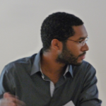
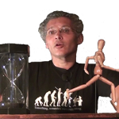

**Le programme de l'édition 2017 est en cours de construction.**

Du lundi 6 mars au vendredi 10 mars, tous les soirs aura lieu une conférence, un débat ou une projection, suivi d'interactions avec le public. Le samedi 11 mars aura lieu une journée d'expérimentations et de mise en contact avec des acteurs locaux de la politique.

<ul class="table-of-content">
    <li><i>Accès rapide : </i></li>
    <li><a href="#2017-lundi">Lundi 6</a></li>
    <li><a href="#2017-mardi">Mardi 7</a></li>
    <li><a href="#2017-mercredi">Mercredi 8</a></li>
    <li><a href="#2017-jeudi">Jeudi 9</a></li>
    <li><a href="#2017-vendredi">Vendredi 10</a></li>
    <li><a href="#2017-samedi">Samedi 11</a></li>
</ul>

*Tous les évènements sont gratuits et en accès libre à l'exception de la soirée du jeudi 9 mars qui est à prix libre.*

<section class="event">
    <header>
        

            

                
                Jean-Michel Knutsen
            

        

        <h2 id="2017-lundi">Lundi 6 mars Transformer la colère en action</h2>
        
18h30 - [Salle des Rancy](/infos/)

    </header>

    
Débat suivi de questions du public

    

    

    

        <b>Jean-Michel Knutsen</b> est organisateur au sein de Citizens UK.
    

</section>

<section class="event">
    <header>
        

            

                
                Pierre Sauze
            

        

        <h2 id="2017-mardi">Mardi 7 mars Pouvoir d'agir en entreprise</h2>
        
18h30 - [Salle des Rancy](/infos/)

    </header>

    
Débat suivi de questions du public

    

    

    

        <b>Pierre Sauze</b> est membre de la SCOP [De l'Autre Côté de la rue](http://www.delautrecotedelarue.net/nouveau/).
    

</section>

<section class="event">
    <header>
        

            

                
                
            

        

        <h2 id="2017-mercredi">Mercredi 8 mars Retours d'expérience de mouvements citoyens</h2>
        
20h - [Salle Vendôme](/infos/)

    </header>

    
Débat suivi de questions du public

    

    

    

        <b>Baptiste Mylondo</b> est enseignant-chercheur en économie et philosophie politique. Il est l'auteur de plusieurs ouvrages sur le revenu d'existence, et milite pour la décroissance.
    

</section>

<section class="event">
    <header>
        

            

                
                Alexis Lecointe
            

        

        <h2 id="2017-jeudi">Jeudi 9 mars Des revenus de base</h2>
        
19h à 22h - [Salle des Rancy](/infos/)

    </header>

    
Conférence gesticulée avec entracte

    

    

    
<b>Alexis Lecointe</b> est retraité. 

</section>

<section class="event">
    <header>
        

            

                
                Nadine Chamard
            

            

                
                Jeanne Demoulin
            

        

        <h2 id="2017-vendredi">Vendredi 10 mars Des listes participatives à Lyon en 2020 ?</h2>
        
19h - [Salle des Rancy](/infos/)

    </header>

    
Débat suivi de questions du public

    

    

    
<b>Nadine Chamard</b> est citoyenne participante au collectif La Belle Démocratie. 

    
<b>Jeanne Demoulin</b> est chercheuse. 

</section>

<section class="event">
    <header>
        

            

                
                Philippe Cazeneuve
            

            

                
                Les Gentils Virus
            

            

                
                Mouvement Français pour un Revenu de Base
            

        

        <h2 id="2017-samedi">Samedi 11 mars Expériences</h2>
        
de 14h à 18h - [Salle des Rancy](/infos/)

    </header>

    
Ateliers ouverts en continu

    

        Après la théorie, la pratique ! Une journée pour expérimenter, mettre en situation, appliquer concrètement des solutions à nos problèmes politiques.
    

    
<b>Philippe Cazeneuve</b> animera l'atelier « [Mise en jeu de la démocratie](http://savoirenactes.info/2015/07/mise-en-jeu-de-la-democratie-atelier-experimental/) », dans lequel les participants sont invités à s'approprier un sujet de société, à en débattre et à faire des propositions autour de ce sujet. 

    
Les <b>Gentils Virus</b> animeront un atelier constituant, durant lequel les participants s'entraineront à écrire des morceaux de constitutions autour d'un sujet déterminé. L'occasion de constater que nous sommes toutes et tous à même d'écrire notre constitution. 

    
Le <b>Mouvement Français pour un Revenu de Base</b> animera un atelier de réflexion sur le revenu de base. Les participants auront à composer leur propre version du revenu de base, à en définir les règles et le fonctionnement, et à défendre leur version devant un panel d'experts. 

</section>

<section class="info full">
    <header>
        <h2>La démocratie à la Bibliothèque Municipale de Lyon partenaire</h2>
    </header>

    
La Bibliothèque de Lyon propose de novembre à mars, tout un programme de découvertes, d’échanges, d’ateliers, d’expérimentation et de moments de réflexions collectives autour de notre pouvoir d’agir et des nouvelles manières de mettre et de gérer en commun des ressources, des idées, des espaces… [Consultez le programme](https://www.bm-lyon.fr/nos-blogs/democratie/article/le-programme-du-15-novembre-2016-au-12-mars-2017) !

    
En point d’orgue à cet évènement, la Bibliothèque proposera du 9 au 12 mars 2017 [trois journées de forum dans la ville](https://www.bm-lyon.fr/nos-blogs/democratie/article/le-forum-dans-la-ville-du-9-au-12-mars). Lieu de découverte et de réflexion, ce forum se tiendra sur trois places publiques. Il sera composé d’ateliers, de temps d’échanges et de rencontres avec celles et ceux qui (r)animent la vie démocratique. En parallèle se tiendront des conférences et des tables-rondes avec des chercheuses et des chercheurs, des intellectuel.le.s, des acteurs et actrices de la démocratie qui débattront des communs, des franges invisibles de notre société, de notre pouvoir d’agir, de l’approfondissement de la démocratie.

</section>
