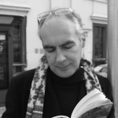
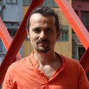
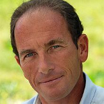
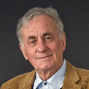

<ul class="table-of-content">
    <li><i>Accès rapide : </i></li>
    <li><a href="#7-mars">Lundi 7</a></li>
    <li><a href="#8-mars">Mardi 8</a></li>
    <li><a href="#9-mars">Mercredi 9</a></li>
    <li><a href="#10-mars">Jeudi 10</a></li>
    <li><a href="#11-mars">Vendredi 11</a></li>
    <li><a href="#12-mars">Samedi 12</a></li>
</ul>

<section class="event">
    <header>
        

            

                
                Hervé Chaygneaud-Dupuy
            

        

        <h2 id="7-mars">Lundi 7 mars Démocratie en transition</h2>
        
18h30 - Salle des Rancy

    </header>

    
Conférence suivie de questions du public

    

        État du système démocratique français, dans sa globalité. Quelles sont les limites de ce système ? Pourquoi échoue-t-il aujourd'hui ? D'où vient la « crise de la représentativité » ? Que veut dire le mot « démocratie » ?
    

    

        <b>Hervé Chaygneaud-Dupuy</b> a fondé et animé les [Ateliers de la Citoyenneté](http://www.ateliersdelacitoyennete.net/). Il écrit régulièrement sur la démocratie, notamment sur son blog [persopolitique](http://www.persopolitique.fr/).
    

</section>

<section class="event">
    <header>
        

            

                
                David Guez
            

        

        <h2 id="8-mars">Mardi 8 mars Résistance</h2>
        
18h30 - Salle des Rancy

    </header>

    
Conférence suivie de questions du public

    

        Dans le système actuel, de nombreux acteurs ne se laissent pas faire. Contrôle des représentants, primaire citoyenne, éducation populaire à la reprise du pouvoir politique, quelles sont les actions concrètes de résistance aujourd'hui ?
    

    

        <b>David Guez</b> est avocat au Barreau de Paris, et cofondateur de democratech, l'association qui développe [LaPrimaire.org](http://laprimaire.org/).
    

</section>

<section class="event">
    <header>
        

            

                
                Baptiste Mylondo
            

        

        <h2 id="9-mars">Mercredi 9 mars Revenu d'existence et politique</h2>
        
20h - Salle Vendôme

    </header>

    
Diffusion d'un film sur le revenu de base, suivie d'une conférence puis de questions du public

    

        Le revenu de base, parmi ses nombreuses vertus, est un outil fondamental pour la reprise du pouvoir par les citoyens. Comment la libération du monde de l'emploi peut-elle amener à un changement profond de notre paysage politique ?
    

    

        <b>Baptiste Mylondo</b> est enseignant-chercheur en économie et philosophie politique. Il est l'auteur de plusieurs ouvrages sur le revenu d'existence, et milite pour la décroissance.
    

</section>

<section class="event">
    <header>
        

            

                
                Loïc Blondiaux
            

            

                
                Conseil de Quartier Moncey-Voltaire-Guichard
            

            

                
                Tristan Rechid <small>(sous réserve)</small>
            

        

        <h2 id="10-mars">Jeudi 10 mars Démocratie participative</h2>
        
19h - Salle des Rancy

    </header>

    
Diffusion du film documentaire « J'AI PAS VOTÉ », suivie d'un débat sur la démocratie participative

    

        Le terme de « démocratie participative » englobe beaucoup de choses. Conseils de quartiers, budgets participatifs, assemblées citoyennes, implication des associations dans les décisions politiques, comment nous dirigeons-nous aujourd'hui vers plus de démocratie ?
    

    
<b>Loïc Blondiaux</b> est enseignant et chercheur en science politique, et travaille notamment sur la démocratie participative. Il dirige la revue [Participations](http://www.revue-participations.fr/) et le groupement d'intérêt scientifique « [démocratie et participation](http://www.participation-et-democratie.fr/) ». 

    
<b>Tristan Rechid</b> est membre du conseil des sages de Saillans, dont la municipalité élue en 2013 a mis en place un processus de gestion de la commune participatif. 

    
<b>« J'AI PAS VOTÉ »</b> est un film documentaire de Moise Courilleau et Morgan Zahnd qui analyse les limites du système politique français et propose de nouvelles pistes d'organisation. 

</section>

<section class="event">
    <header>
        

            

                
                Etienne Chouard
            

            

                
                Jacques Testart <small>(sous réserve)</small>
            

        

        <h2 id="11-mars">Vendredi 11 mars Tirage au sort et démocratie</h2>
        
19h - Lieu à annoncer

    </header>

    
Débat suivi de questions du public

    

        Et si on allait plus loin ? Puisque le système pose problème, pourquoi ne pas en changer ? Quelles sont les propositions de systèmes politiques alternatifs proposées aujourd'hui, que résolvent-elles, et comment les mettre en place ?
    

    
<b>Etienne Chouard</b> est professeur d'économie et blogueur. Il travaille sur la démocratie et l'importance du tirage au sort dans cele-ci, et milite pour la formation d'une assemblée constituante tirée au sort. 

    
<b>Jacques Testart</b> est biologiste spécialisé dans la reproduction des animaux et de l'homme. Il a récemment publié «&nbsp;L'humanitude au pouvoir&nbsp;», dans lequel il soutient que les citoyens sont aptes à prendre des décisions au nom de l’intérêt commun de l’humanité. 

</section>

<section class="event">
    <header>
        

            

                
                Philippe Cazeneuve
            

            

                
                Les Gentils Virus
            

            

                
                Mouvement Français pour un Revenu de Base
            

        

        <h2 id="12-mars">Samedi 12 mars Expériences</h2>
        
de 14h à 18h - Salle des Rancy

    </header>

    
Ateliers ouverts en continu

    

        Jouer la démocratie, écrire une constitution, imaginer son revenu de base… Cette journée sera consacrée à l'expérimentation, la mise en situation, l'application concrète de solutions à nos problèmes politiques.
    

    
<b>Philippe Cazeneuve</b> animera l'atelier « [Mise en jeu de la démocratie](http://savoirenactes.info/2015/07/mise-en-jeu-de-la-democratie-atelier-experimental/) », dans lequel les participants sont invités à s'approprier un sujet de société, à en débattre et à faire des propositions autour de ce sujet. 

    
Les <b>Gentils Virus</b> animeront un atelier constituant, durant lequel les participants s'entraineront à écrire des morceaux de constitutions autour d'un sujet déterminé. L'occasion de constater que nous sommes toutes et tous à même d'écrire notre constitution. 

    
Le <b>Mouvement Français pour un Revenu de Base</b> animera un atelier de réflexion sur le revenu de base. Les participants auront à composer leur propre version du revenu de base, à en définir les règles et le fonctionnement, et à défendre leur version devant un panel d'experts. 

</section>
