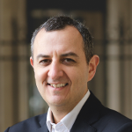

<ul class="table-of-content">
    <li><i>Accès rapide : </i></li>
    <li><a href="#7-mars">Lundi 7</a></li>
    <li><a href="#8-mars">Mardi 8</a></li>
    <li><a href="#9-mars">Mercredi 9</a></li>
    <li><a href="#10-mars">Jeudi 10</a></li>
    <li><a href="#11-mars">Vendredi 11</a></li>
    <li><a href="#12-mars">Samedi 12</a></li>
</ul>

<section class="event">
    <header>
        

            

                
                Hervé Chaygneaud-Dupuy
            

        

        <h2 id="7-mars">Lundi 7 mars Démocratie en transition</h2>
        
18h30 - Salle des Rancy

    </header>

    
Conférence suivie de questions du public

    

        La « crise de la représentativité », le désintérêt ou le sentiment d'impuissance face aux décisions politiques trouvent leurs sources, entre autres, dans les limites imposées par le système politique français. Quels constats établir aujourd'hui à propos d'une démocratie qui se questionne sur ses origines, ses dérives et ses échecs ? Et quels remèdes envisager ?
    

    

        <b>Hervé Chaygneaud-Dupuy</b> a fondé et animé les [Ateliers de la Citoyenneté](http://www.ateliersdelacitoyennete.net/). Il écrit régulièrement sur la démocratie, notamment sur son blog [persopolitique](http://www.persopolitique.fr/).
    

</section>

<section class="event">
    <header>
        

            

                
                David Guez
            

        

        <h2 id="8-mars">Mardi 8 mars Résistance</h2>
        
18h30 - Salle des Rancy

    </header>

    
Conférence suivie de questions du public

    

        Dans un système appartenant aux partis et élites politiques, des initiatives proposent de contourner, d'affronter, d'inventer les règles du jeu… Ou juste de les appliquer strictement ! La résistance fait ainsi preuve d'une imagination foisonnante, utilisant les nouvelles technologies et les réseaux pour mobiliser différemment et se réapproprier les institutions.
    

    

        <b>David Guez</b> est avocat au Barreau de Paris, et cofondateur de democratech, l'association qui développe [LaPrimaire.org](http://laprimaire.org/).
    

</section>

<section class="event">
    <header>
        

            

                
                Baptiste Mylondo
            

        

        <h2 id="9-mars">Mercredi 9 mars Revenu d'existence et politique</h2>
        
20h - Salle Vendôme

    </header>

    
Diffusion d'un film sur le revenu de base, suivie d'une conférence puis de questions du public

    

        Promu par des personnalités de tous horizons et de toutes sensibilités, le revenu de base, outre la liberté et l'égalité qu'il entraîne, permettrait l'affranchissement du monde de l'emploi. En quoi la fin du salariat imposé peut-elle amener à un changement profond de notre paysage politique ?
    

    

        <b>Baptiste Mylondo</b> est enseignant-chercheur en économie et philosophie politique. Il est l'auteur de plusieurs ouvrages sur le revenu d'existence, et milite pour la décroissance.
    

</section>

<section class="event">
    <header>
        

            

                
                Loïc Blondiaux
            

            

                
                Serge Patural
            

            

                
                Tristan Rechid <small>(sous réserve)</small>
            

        

        <h2 id="10-mars">Jeudi 10 mars Démocratie participative</h2>
        
19h - Salle des Rancy

    </header>

    
Diffusion du film documentaire « J'AI PAS VOTÉ », suivie d'un débat sur la démocratie participative

    

        La démocratie participative englobe aujourd'hui plusieurs réalités : conseils de quartier, assemblées citoyennes, budgets participatifs ou décisions politiques partagées. Entre ce qui existe et ce qui reste à inventer, comment se diriger vers une démocratie augmentée ?
    

    
<b>Loïc Blondiaux</b> est enseignant et chercheur en science politique, et travaille notamment sur la démocratie participative. Il dirige la revue [Participations](http://www.revue-participations.fr/) et le groupement d'intérêt scientifique « [démocratie et participation](http://www.participation-et-democratie.fr/) ». 

    
<b>Serge Patural</b> est membre du conseil de quartier Mutualité-Préfecture-Moncey à Lyon, conseil constitué de citoyens qui travaillent à l'amélioration du cadre de vie du 3e arrondissement. 

    
<b>Tristan Rechid</b> est membre du conseil des sages de Saillans, dont la municipalité élue en 2014 a mis en place un processus participatif de gestion de la commune. 

    
<b>« J'AI PAS VOTÉ »</b> est un film documentaire de Moise Courilleau et Morgan Zahnd qui analyse les limites du système politique français et propose de nouvelles pistes d'organisation. 

</section>

<section class="event">
    <header>
        

            

                
                Etienne Chouard
            

            

                
                Jacques Testart <small>(sous réserve)</small>
            

        

        <h2 id="11-mars">Vendredi 11 mars Tirage au sort et démocratie</h2>
        
19h - Lieu à annoncer

    </header>

    
Débat suivi de questions du public

    

        Si notre système politique et démocratique présente des limites infranchissables, peut-être faut-il le repenser entièrement. Quels sont les systèmes politiques alternatifs proposés aujourd'hui, que résolvent-ils, et comment les mettre en place ?
    

    
<b>Etienne Chouard</b> est professeur d'économie et blogueur. Il travaille sur la démocratie et l'importance du tirage au sort dans celle-ci, et milite pour la formation d'une assemblée constituante tirée au sort. 

    
<b>Jacques Testart</b> est biologiste spécialisé dans la reproduction des animaux et de l'homme. Il a récemment publié «&nbsp;L'humanitude au pouvoir&nbsp;», dans lequel il soutient que les citoyens sont aptes à prendre des décisions au nom de l’intérêt commun de l’humanité. 

</section>

<section class="event">
    <header>
        

            

                
                Philippe Cazeneuve
            

            

                
                Les Gentils Virus
            

            

                
                Mouvement Français pour un Revenu de Base
            

        

        <h2 id="12-mars">Samedi 12 mars Expériences</h2>
        
de 14h à 18h - Salle des Rancy

    </header>

    
Ateliers ouverts en continu

    

        Après la théorie, la pratique ! Une journée pour expérimenter, mettre en situation, appliquer concrètement des solutions à nos problèmes politiques.
    

    
<b>Philippe Cazeneuve</b> animera l'atelier « [Mise en jeu de la démocratie](http://savoirenactes.info/2015/07/mise-en-jeu-de-la-democratie-atelier-experimental/) », dans lequel les participants sont invités à s'approprier un sujet de société, à en débattre et à faire des propositions autour de ce sujet. 

    
Les <b>Gentils Virus</b> animeront un atelier constituant, durant lequel les participants s'entraineront à écrire des morceaux de constitutions autour d'un sujet déterminé. L'occasion de constater que nous sommes toutes et tous à même d'écrire notre constitution. 

    
Le <b>Mouvement Français pour un Revenu de Base</b> animera un atelier de réflexion sur le revenu de base. Les participants auront à composer leur propre version du revenu de base, à en définir les règles et le fonctionnement, et à défendre leur version devant un panel d'experts. 

</section>
