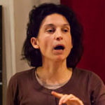

Du lundi 5 mars au vendredi 9 mars, tous les soirs aura lieu une conférence, un débat, une projection ou un atelier. Le samedi 11 mars aura lieu une journée conviviale, avec repas partagé, atelier, mini-conférences, etc.

<ul class="table-of-content">
    <li><i>Accès rapide : </i></li>
    <li><a href="#2018-lundi">Lundi 5</a></li>
    <li><a href="#2018-mardi">Mardi 6</a></li>
    <li><a href="#2018-mercredi">Mercredi 7</a></li>
    <li><a href="#2018-jeudi">Jeudi 8</a></li>
    <li><a href="#2018-vendredi">Vendredi 9</a></li>
    <li><a href="#2018-samedi">Samedi 10</a></li>
</ul>

*Tous les évènements sont en accès et à prix libre, à l'exception de la soirée du mercredi 8 mars qui est sur réservation, et du Ciné-Animé du samedi 10 mars qui est payant (4€50).*

<section class="event">
    <header>
        <h2 id="2018-lundi">Lundi 5 mars L'Assemblée, de Mariana Otero</h2>
        
19h00 - [Salle des Rancy](/infos/)

    </header>

    

        Projection (1h35) suivie d'un débat
    

    

        Le 31 mars 2016, place de la République à Paris nait le mouvement Nuit Debout. Pendant plus de trois mois, des gens venus de tous horizons s’essayent avec passion à l’invention d’une nouvelle forme de démocratie.  Comment parler ensemble sans parler d’une seule voix ?
    

    

        <b>L'Assemblée</b> est un film documentaire réalisé par [Mariana Otero](https://fr.wikipedia.org/wiki/Mariana_Otero) et sorti le 18 octobre 2017. Suite à la projection du film, les spectateur⋅rice⋅s seront invité⋅e⋅s à débattre des questions soulevées par le film autour du bar de la Maison Pour Tous.
    

</section>

<section class="event">
    <header>
        <h2 id="2018-mardi">Mardi 6 mars Apéro Civique</h2>
        
19h00 - [Salle des Rancy](/infos/)

    </header>

    

        Apéritif partagé autour d'un quizz convivial (pensez à amener quelque chose à partager !)
    

    

        Ville de Lyon, Grand Lyon, département du Rhône : quelles différences pour nous citoyen⋅ne⋅s ?  Depuis quelques années, on nous dit que le département du Rhône a perdu Lyon, mais Lyon reste dans le 69. Au milieu de tout ça, un truc qui s'appelle Le Grand Lyon (rebaptisé La Métropole) semble prendre de l'importance. Mais qui a décidé ça, et qui sont les élus du peuple dans tout ça ?  Cet «&nbsp;apéroquizz&nbsp;» permettra d'y voir plus clair !
    

    

        Animé par **Philippe Guelpa-Bonaro** et d'autres citoyen⋅ne⋅s.
    

</section>

<section class="event">
    <header>
        

            

                
                Corinne Lepage
            

        

        <h2 id="2018-mercredi">Mercredi 7 mars Militantisme, mon amour ! Du collage au décollage</h2>
        
Conférence à 20h00 - Atelier de 18h à 19h30 - [Salle des Rancy](/infos/)

    </header>

    

        Conférence gesticulée (2h), précédée d'un atelier (voir ci-dessous)
    

    

        «&nbsp;C’est de l’intérieur qu’on peut changer les choses&nbsp;». Soit, puisqu’il fallait s’y frotter, elle allait s’y coller. Alors, elle a adhéré : au travail, au parti, au syndicat. Elle s’est tout coltinée pour lutter de l’intérieur, a même fini par racoler et s’est retrouvée engluée. Rien n’a changé. Ses mots n’étaient pas les leurs et c’est son corps qui le lui a dit. C’est en se décollant, qu’elle a enfin pu militer.
    

    

        <b>Corinne Lepage</b> a été tour à tour marxiste révolutionnaire, doctorante en philosophie, adjointe au tourisme et à la culture, représentante du personnel… Un militantisme varié, qu'elle met aujourd'hui au service de l'éducation populaire.
    

    

    <h4>Atelier «&nbsp;Échange et récit des actions militantes&nbsp;»</h4>

    

        Atelier, animé par Corinne Lepage, de 18h à 19h30
    

    

        Avant sa conférence gesticulée, Corinne Lepage propose aux personnes intéressées un partage d’expériences, en vue d’analyser et de se donner des outils pour réussir des actions militantes : pourquoi ça marche ? Pourquoi ça ne marche pas ?
    

</section>

<section class="event">
    <header>
        

            

                
                Rami Brahem
            

        

        <h2 id="2018-jeudi">Jeudi 8 mars Comprendre l’horizontalité, les enjeux politiques et révolutionnaires du 21ème siècle</h2>
        
19h00 - [Salle des Rancy](/infos/)

    </header>

    

        Conférence vivante (2h)
    

    

        Vers quel système politique et économique se diriger ? Où porter le regard et les espoirs pour le monde de demain ? Qu’est ce que l’horizontalité ? L’intelligence collective et les clés de la synergie ? Qu’en comprendre pour le monde d’aujourd’hui et de demain ? Quelles actions entreprendre ?
    

    

        Cette conférence vivante apportera des clés de compréhension autour de la croissance exponentielle du champ de l’auto-organisation et des conclusions que l’on peut tirer de ces expériences concrètes. *Du révolutionnaire au rebelle social*, à la découverte des nouveaux modes de transformation sociale&hellip;
    

    

        <b>Rami Brahem</b> revient en France après 7 ans de participation au processus révolutionnaire en Tunisie où il a co-organisé un nombre important d’organisations non hiérarchiques. Il travaille sur le concept d’horizontalité et le champ de l’intelligence collective par l’étude des organisations auto-organisées, une recherche pluri-disciplinaire et une solide expérience de terrain. Il co-créée aujourd’hui un *espace émancipé et émancipateur*, au travers d’une nouvelle forme d’organisation pour coopératives et collectifs.
    

    

    <h4>Le service civique, une forme d'engagement pour les jeunes de 16 à 25 ans</h4>

    

        Stand tenu par [Unis-Cité](http://www.uniscite.fr/) et le [Point Information Jeunesse](https://www.salledesrancy.com/enfance-jeunesse/pij-point-information-jeunesse/) de la Maison Pour Tous.
    

    

        De 17h30 à 19h, tenue d'un stand de présentation et de témoignages avec des volontaires en service civique.
    

</section>

<section class="event">
    <header>
        

            

                
                CDRIC
            

        

        <h2 id="2018-vendredi">Vendredi 9 mars Vivre une assemblée horizontale</h2>
        
19h00 - [Salle des Rancy](/infos/)

    </header>

    

        Atelier d'assemblée citoyenne horizontale
    

    

        Au travers d’une mise en situation, cet atelier permettra de découvrir comment se mettre en accord les uns avec les autres. Mise en situation proposée1 : Panique au village ! Suite à une panne du climatiseur, tous les responsables politiques sont en grève pour l’été. Malheureusement, il y a une série de problèmes urgent à résoudre et plus personne pour diriger la barque ! Que faire ?
    

    

        L’équipe du [**CDRIC**](http://cdric.co/) (*Centre de Documentation et de Recherche en Intelligence Collective*) facilitera et animera une assemblée horizontale où tous seront soumis aux mêmes règles. Équipe de facilitation : Rami Brahem, Christophe Dumais, Krishen Pather, Jeremy Montagny.
    

    

        *1 En fonction des attentes et préférences des participant⋅e⋅s, les mises en situation peuvent être modifiées, voire toucher des sujets concrets ou d’actualité.*
    

</section>

<section class="event">
    <header>
        <h2 id="2018-samedi">Samedi 10 mars Vivre ensemble</h2>
        
De 10h00 à 21h00 - [Salle des Rancy](/infos/)

    </header>

    <h3>
        10h - 12h
        Ciné-Animé Graines de citoyens
    </h3>

    

        Projections-débats avec les enfants et leurs parents visant à sensibiliser les plus jeunes au respect des différences et les éveiller aux droits de l'Homme.
    

    

        Attention : cet événement est payant, 4€50 par personne (parent et enfant).
    

    <h3>
        12h - 14h
        Repas partagé
    </h3>

    

        Venez partager un bon repas avec vos voisins proches ou lointains ! Des temps d'animation auront lieu pendant le repas. Merci d'apporter quelque chose à manger et à boire à partager.
    

    <h3>
        14h - 15h30
        Café à palabres
    </h3>

    

        En Afrique, l'arbre à palabres est le lieu où l'on se rassemble pour discuter de la vie en société, des problèmes du village, de politique. Au lieu d'arbres, nous vous proposons de nous retrouver autour d'un café (et autres boissons) afin de «&nbsp;palabrer&nbsp;» sur la politique locale, sur les problèmes que nous recontrons au quotidien, et sur ce que nous pouvons faire pour les résoudre. Une équipe d'animation sera présente pour aider au bon déroulement des discussions et débats.
    

    

        *Les boissons sont offertes par la Maison Pour Tous.*
    

    <h3>
        16h - 18h
        Atelier IPIC
    </h3>

    

        IPIC (*Informations Populaires Inventives et Chaleureuses*) propose des outils d'argumentation, d'action par le jeu et l'expérimentation pour avoir des clés dans un débat dans toute situation du quotidien, dans un esprit de théâtre engagé.
    

    <h3>
        18h - 19h30
        Conférences
    </h3>

    

        Cycle de 6 conférences de 15 minutes. Les intervenant⋅e⋅s seront disponibles au bar de la MPT après les conférences pour discuter.
    

    <ul>
        <li>
            Découvrez le revenu universel idéal : le R.E.V.E. (*Jean-François Rochas-Parrot*)
        </li>
        <li>
            La proposition d'un code du travail alternatif (*Carole Giraudet*)
        </li>
        <li>
            Introduction à la décroissance (*Baptiste Mylondo*)
        </li>
        <li>
            Transformer le travail pour transformer la société ? (*Karine Melzer*)
        </li>
        <li>
            Une coopérative immobilière : demain, on loge gratis ? (*Robin Corriol*)
        </li>
        <li>
            Comment rendre la ville plus mixte, égalitaire et inclusive ? (*Justine Noël*)
        </li>
    </ul>

    <h3>
        19h30
        Apéro partagé
    </h3>

    

        Pour bien finir cette semaine d'expériences politiques, quoi de mieux que de se détendre autour d'un verre ? Merci d'amener quelque chose à boire ou à grignoter afin de rendre ce moment plus convivial !
    

</section>
